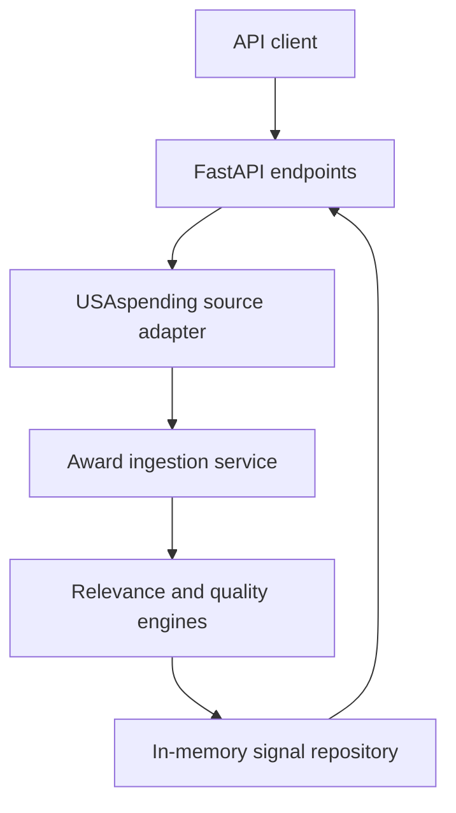

# Architecture

## Purpose

Orbital Signal is an early-warning intelligence system for discovering emerging
space companies through public evidence.

The current release ingests federal contract awards, identifies space-related
activity, evaluates whether each event belongs in a startup-candidate feed, and
exposes the resulting signals through an API.

## System flow



A live ingestion follows this sequence:

1. A client submits a date range to the USAspending ingestion endpoint.
2. The source adapter searches NASA and Department of Defense prime contracts.
3. USAspending responses are normalized into source-independent `AwardRecord`
   objects.
4. The relevance engine assigns an explainable space-relevance score.
5. Awards below the relevance threshold are discarded.
6. The quality engine classifies the recipient and evaluates event quality.
7. Relevant awards become `CompanySignal` objects.
8. The repository upserts signals using deterministic identifiers.
9. The API returns ingestion counts or the retained signals.

## Package structure

| Module | Responsibility |
| --- | --- |
| `api.py` | Creates the FastAPI application and defines HTTP endpoints |
| `cli.py` | Provides the installed command-line entry point |
| `config.py` | Loads runtime configuration through Pydantic settings |
| `domain.py` | Defines typed source, assessment, signal, and result models |
| `quality.py` | Classifies organizations and evaluates startup-feed eligibility |
| `relevance.py` | Scores space relevance and records supporting evidence |
| `repository.py` | Stores and retrieves signals |
| `services.py` | Coordinates ingestion, scoring, transformation, and storage |
| `sources/usaspending.py` | Fetches and normalizes USAspending contract awards |

## Domain model

### AwardRecord

`AwardRecord` is the normalized representation of a federal award. Source
adapters convert external payloads into this model before the rest of the
application processes them.

Important fields include:

- Source and source award identifier
- Recipient name and UEI
- Award amount
- Awarding agency
- Award description
- Start and end dates
- NAICS and PSC classification codes
- Source evidence URL

Keeping this model source-independent allows future sources to enter the same
processing pipeline without coupling the scoring system to USAspending response
formats.

### RelevanceAssessment

`RelevanceAssessment` contains:

- A bounded relevance score
- A Boolean space-relevance decision
- Matched terms
- Human-readable scoring reasons

The score is deterministic and explainable. It is not generated by a language
model.

### SignalQualityAssessment

Space relevance and startup relevance answer different questions.

A contract can be strongly related to space while still being unsuitable for a
startup feed because the recipient is a university, the event is administrative,
or the award amount is immaterial.

`SignalQualityAssessment` therefore records:

- Broad organization type
- Startup-candidate eligibility
- Quality flags explaining exclusions

The current organization classifications are:

- `company`
- `academic_or_research`
- `government_or_nonprofit`
- `unknown`

A startup candidate is presently a commercial recipient with a qualifying
space-related event. It is not yet a verified claim about company age, ownership,
funding stage, or venture backing.

### CompanySignal

`CompanySignal` is the API-facing intelligence record. It combines:

- Recipient identity
- Award event details
- Space-relevance evidence
- Organization classification
- Startup-candidate status
- Quality flags
- Source attribution
- Detection time

The current `occurred_on` field is populated from the federal award start date.
A future release should rename it to `award_start_date` to make that meaning
explicit.

## Source integration

The Alpha 2 source adapter uses the public USAspending award search API.

It searches NASA and the Department of Defense independently. This prevents the
much larger defense result set from crowding NASA awards out of the bounded
ingestion window.

Current defaults:

- Prime contract award types
- Five pages per agency
- Up to 100 records per page
- Maximum of 1,000 fetched records across the two default agencies
- Results ordered by award start date

The adapter deduplicates source records by award identifier before returning
normalized awards.

## Relevance engine

The relevance engine evaluates four evidence categories:

| Evidence | Points |
| --- | ---: |
| Space-focused awarding organization | 3 |
| Strong space term | 4 |
| Supporting aerospace term | 2 |
| Space-manufacturing NAICS code | 5 |
| Space-related PSC code | 4 |

The default inclusion threshold is `4`.

Agency membership alone is intentionally insufficient. A NASA award must contain
additional space evidence or a qualifying industry code before it enters the
signal repository.

Strong terms include examples such as:

- `spacecraft`
- `satellite`
- `orbital`
- `rocket engine`
- `lunar`
- `cislunar`
- `payload`

Supporting terms include examples such as:

- `propulsion`
- `telemetry`
- `remote sensing`
- `ground station`
- `hypersonic`
- `in-space`

Phrase matching uses token boundaries to reduce accidental substring matches.
The phrase `orbital welding` is explicitly protected because it commonly refers
to a welding process rather than spaceflight.

## Quality engine

The quality engine applies recipient and event rules after an award has passed
space-relevance scoring.

Current exclusion signals include:

- Academic or research institution names
- Government or nonprofit institution names
- Unknown recipient types
- Awards below `$25,000`
- Instructor-led training
- Orbital welding training
- Conference or exhibit-space purchases
- Equipment activation or repair activity
- Administrative supplies

Raw relevant signals remain queryable even when excluded from the
startup-candidate view. This preserves evidence and keeps filtering decisions
auditable.

## Identity and deduplication

Each signal receives a stable identifier derived from:

```text
source + source_award_id
```

The combined value is hashed with SHA-256 and shortened to 20 hexadecimal
characters.

The in-memory repository uses this identifier as its upsert key. Re-ingesting an
existing award updates the stored signal but counts it as a duplicate rather
than a newly inserted record.

Recipient UEI values are preserved when available. Durable company identity
resolution and company aliases are planned for the persistence milestone.

## API surface

| Method | Route | Responsibility |
| --- | --- | --- |
| `GET` | `/health` | Return service status and application version |
| `POST` | `/api/v1/ingestions/usaspending` | Ingest awards for a date range |
| `GET` | `/api/v1/signals` | Retrieve retained signals |

Signal queries support:

- Minimum relevance score
- Result limit
- Startup-candidate-only filtering

The API translates upstream HTTP failures into a `502 Bad Gateway` response.
Invalid date ranges return a validation error.

## Storage boundary

Alpha 2 uses `InMemorySignalRepository`.

This keeps the first vertical slice small and testable, but it has important
limitations:

- Data disappears when the process stops.
- Multiple API processes do not share state.
- Ingestion history is not retained.
- Company aliases cannot be managed durably.
- Database-level uniqueness and transactions are unavailable.

## Planned persistence architecture

The next storage milestone will replace in-memory state with PostgreSQL and
Alembic migrations.

The initial durable model is expected to include:

| Entity | Purpose |
| --- | --- |
| `companies` | Canonical company identities |
| `company_aliases` | Alternate names connected to canonical companies |
| `awards` | Normalized government award evidence |
| `signals` | Scored intelligence events |
| `ingestion_runs` | Source execution history and result counts |

Repository interfaces should remain separate from HTTP and source-adapter code so
the persistence implementation can change without rewriting the ingestion
pipeline.

## Testing strategy

Tests use fake HTTP responses and injected repositories so normal test runs do
not depend on the live USAspending service.

The suite covers:

- Source payload construction and response mapping
- Relevance scoring and phrase boundaries
- Organization classification
- Event-quality flags
- Ingestion counts and deduplication
- API validation and filtering
- Upstream service failures

The required local quality gates are:

```bash
uv run ruff check .
uv run ruff format --check .
uv run pytest
```

## Design principles

Orbital Signal follows these principles:

1. Preserve source evidence.
2. Keep scoring explainable.
3. Separate space relevance from startup eligibility.
4. Normalize external data at the system boundary.
5. Prefer deterministic identifiers and idempotent ingestion.
6. Keep source, domain, service, and storage concerns independent.
7. Add durable infrastructure only after the signal model is calibrated.